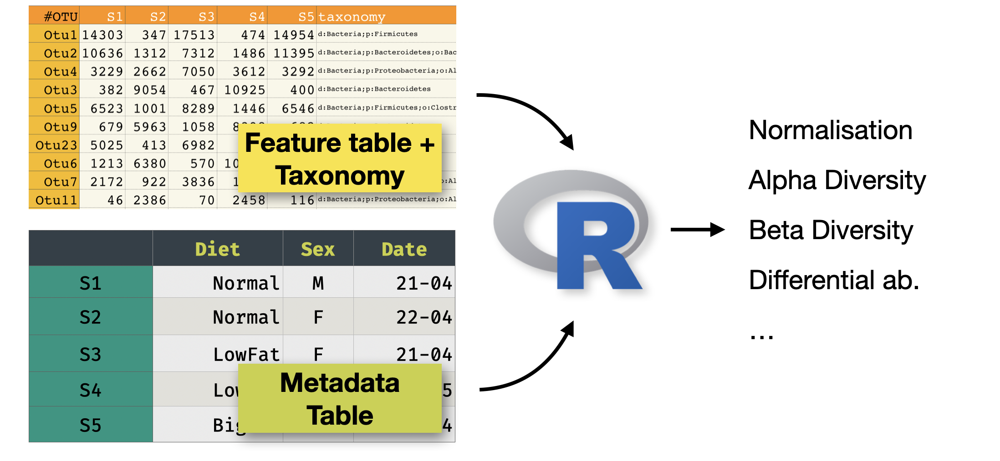
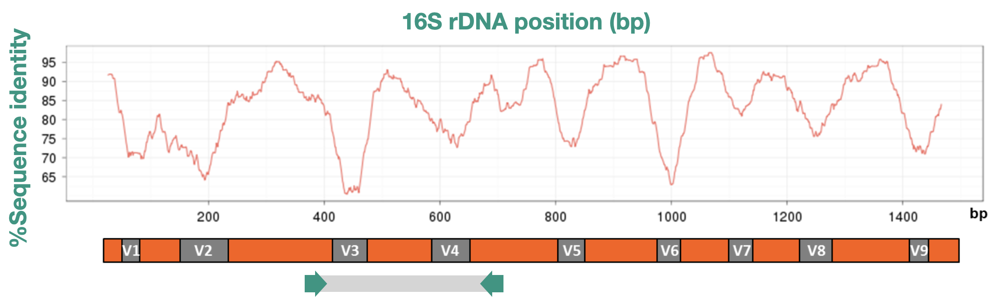

# Introduction {.unnumbered}

## About this training



This is a tutorial to analyse a metabarcoding dataset (in our case 16S) using DADA2.
The input is a set of FASTQ files (typically, and in our case Illumina paired-end), and the output will be:

- A set of *representative sequences* (ASVs)
- A *feature counts table* (raw counts of ASVs per sample)
- The *taxonomy* of each representative sequence

We will use [DADA2](https://benjjneb.github.io/dada2/), and for our example will will use a recent dataset sequenced
on NextSeq 2000, that uses a *binned quality* model that would not work nicely with the standard
DADA2 tutorials.

> Citation:
> Callahan *et al*.  (2026) [DADA2: High-resolution sample inference from Illumina amplicon data
](https://www.nature.com/articles/nmeth.3869)

## Trainers

This session is designed and delivered by [QIB Core Bioinformatics](https://quadram-institute-bioscience.github.io/) and in particular Andrea Telatin, Judit Talas and Alise Ponsero.

## What is 16S metabarcoding?



16S metabarcoding is a culture-independent method to profile the bacterial communities
present in a sample. It works by amplifying and sequencing a specific region of the
bacterial 16S ribosomal RNA gene, a highly conserved gene found in virtually all
bacteria. 

A key feature of the gene is an alternation of very conserved regions (where we can design
"universal primers" and hypervariable regions).

The typical workflow (*and its biases*) is:

1. Extract DNA from the sample (*are all cells breaking?*)
2. PCR-amplify the 16S gene using universal primers (*are we preferentially amplifying some taxa?*)
3. Sequence the amplicons on an Illumina platform (paired-end) (*we need to sequence only a fraction of the 1500bp gene!*)
4. Process the raw reads computationally to identify and quantify microbial taxa


## ASVs vs OTUs

Historically, 16S data were analysed by clustering similar sequences into
**Operational Taxonomic Units (OTUs)** at a fixed similarity threshold (typically 97%). One of the many popular packages offering OTU analysis is [Mothur](https://doi.org/10.7717/peerj.1487).
This approach is fast but loses resolution, meaning that sequences that differ by even one nucleotide
are collapsed together. This approach was simultaneously dealing with sequencing errors and
simplyfing the identification of key taxa.

Modern pipelines instead resolve 
**[Amplicon Sequence Variants (ASVs)](https://doi.org/10.1038/ismej.2017.119)**: exact, denoised
sequences inferred from the data.

ASVs offer some benefits:

- Higher resolution — single-nucleotide differences are preserved
- Reproducibility — the same ASV sequence means the same biological entity across
  studies and platforms
- No arbitrary threshold — no need to choose a similarity cutoff (historically OTUs were clustered at 97% for no good reason)

But also some disadvantages:

- Some species will be [artificially split](https://doi.org/10.1128/msphere.00191-21) into multiple ASVs (there is variability in 16S opersons in the same species)
- Some algorithms like DADA2 are sensitive to sequencing quality
  
DADA2 is the leading ASV-based pipeline and is what we will use throughout this tutorial.
 
 
## The dataset

This tutorial uses real 16S amplicon data from a cucumber [fermentation study](https://www.ebi.ac.uk/ena/browser/view/PRJEB112055).
The [**metadata file**](https://gist.github.com/telatin/9447c3dc9175ba500fe9f6a6f6df8d71) allows to download the raw reads.

Three types of fermentation were compared at multiple time points:

| Group | Description |
|-------|-------------|
| **Lactobacillus** | Brine inoculated with a *Lactobacillus* starter culture |
| **Spontaneous** | Brine fermented without a starter culture |
| **Commercial** | A commercially produced fermented cucumber product |
| **Controls** | Negative controls (fermentation and extraction blanks) |

Time points: 24 hours (`H24`), 48 hours (`H48`), 1 week (`W1`), 2 weeks (`W2`).
Each condition has three replicates. In total there are **29 samples**.

Samples were sequenced on an **Illumina NextSeq 2000** — an important detail that
affects how we model sequencing errors (explained in @sec-error-models).

## Pipeline overview

```
Raw reads (FASTQ)
      │
      ▼
Quality assessment  ──── plotQualityProfile()
      │
      ▼
Filtering & trimming ─── filterAndTrim()
      │
      ▼
Error rate modelling ─── learnErrors()   ◄─ key step for NextSeq 2000
      │
      ▼
Denoising ────────────── dada()
      │
      ▼
Merge paired reads ───── mergePairs()
      │
      ▼
Sequence table ────────── makeSequenceTable()
      │
      ▼
Chimera removal ────────── removeBimeraDenovo()
      │
      ▼
Taxonomy assignment ─────── assignTaxonomy()
      │
      ▼
Phyloseq object ─────────── phyloseq()
      │
      ▼
Export (RDS, CSV)
```

## Software requirements

All packages can be installed from [Bioconductor](https://www.bioconductor.org) / CRAN:

```r
# Run once to install Bioconductor "installer"
if (!requireNamespace("BiocManager", quietly = TRUE))
  install.packages("BiocManager")

# We can now install DADA2 and other packages
BiocManager::install(c("dada2", "phyloseq", "Biostrings"))

# And tidyverse...
install.packages(c("tidyverse"))
```

The analysis was developed and tested with:

- R ≥ 4.3
- dada2 ≥ 1.28
- phyloseq ≥ 1.44
- tidyverse ≥ 2.0

## R Markdown version

This website is built with Quarto and analyses a full dataset.
An [R markdown](r/index.html) version that focus on a subset of the raw data is available here.
